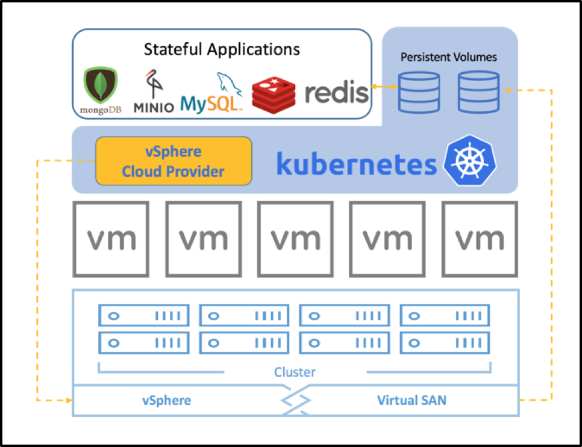

## Overview

Containers are stateless and ephemeral but applications are stateful and need persistent storage. vSphere adds this persistent storage support to Kubernetes through interface called Cloud Provider.

Kubernetes cloud providers are an interface to integrate various node (i.e. hosts), load balancers and networking routes. This interface allows extending Kubernetes to use various cloud and virtualization solutions as a base infrastructure to run on.

Kubernetes Cloud Providers provide the following interfaces to effectively integrate cloud platforms into Kubernetes:

* **Instances** - interface for virtual machine management
* **Load Balancers** - interface to integrate with load balancer provided by cloud platform
* **Routes** - interface to add new routing rules of cloud platform
* **Zones** - integrate with zones if implemented by cloud platform

## vSphere storage concepts

VMware offers a Cloud Provider known as the `vSphere Cloud Provider` (`VCP`) for Kubernetes which allows `Pods` to use enterprise grade persistent storage.

vSphere has a proven Software Defined Storage (SDS) platform that integrates with block, file and hyper converged offerings such as [VMware vSAN](https://storagehub.vmware.com/t/vmware-vsan/). These storage offerings can be exposed as VMFS, NFS, VVOL or vSAN datastores.

vSphere has enterprise grade features like [`Storage Policy Based Management` (`SPBM`)](https://www.youtube.com/watch?v=e0wkMPDvKPQ) which enables customers to define performance, availability and redundancy levels requested by their business critical applications and ensure compliance with these SLAs. vSphere provides various data services out of the box such high availability and data redundancy for containers using Kubernetes.

A vSphere datastore is an abstraction which hides storage details (such as LUNs) and provides a uniform interface for storing persistent data. Datastores enable simplified storage management and data services for storage presented to vSphere. Depending on the backend storage used, the datastores can be of the type vSAN, VMFS, NFS & VVol.

* **vSAN** is a hyper-converged infrastructure storage which provides excellent performance as well as reliability. vSAN is a simple storage system with management features like policy driven administration.
* **VMFS** (Virtual Machine File System) is a cluster file system that allows virtualization to scale beyond a single node for multiple VMware ESX servers. VMFS increases resource utilization by providing shared access to pool of storage.
* **NFS** (Network File System) is a distributed file protocol to access storage over network like local storage. vSphere supports NFS as backend to store virtual machines files.
* **VVOL** (Virtual Volumes) - Virtual Volumes datastore represents a storage container in vCenter Server and vSphere Web Client.

## Kubernetes storage support

The vSphere Cloud Provider supports every storage primitive exposed by Kubernetes:

* [PersistentVolume (PV)](https://kubernetes.io/docs/concepts/storage/persistent-volumes/)
* [PersistentVolumesClaim (PVC)](https://kubernetes.io/docs/concepts/storage/persistent-volumes/#persistentvolumeclaims)
* [StorageClass](https://kubernetes.io/docs/concepts/storage/storage-classes/#vsphere)

PersistentVolumes requested by stateful containerized applications can be provisioned on vSAN, VVOL, VMFS or NFS datastores.

Kubernetes PVs are defined in `Pod` specifications. They can reference VMDK files directly if using Static Provisioning, or `PVCs` when using Dynamic Provisioning (preferred).

